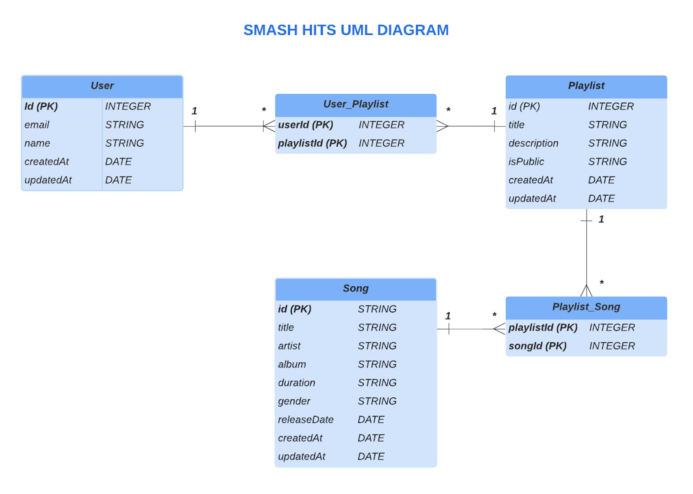
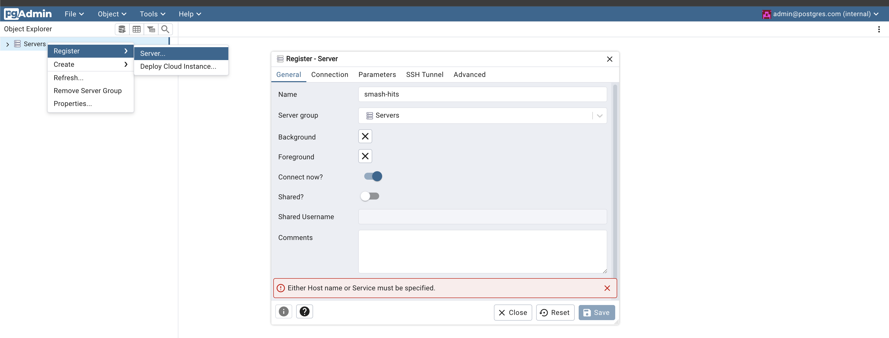
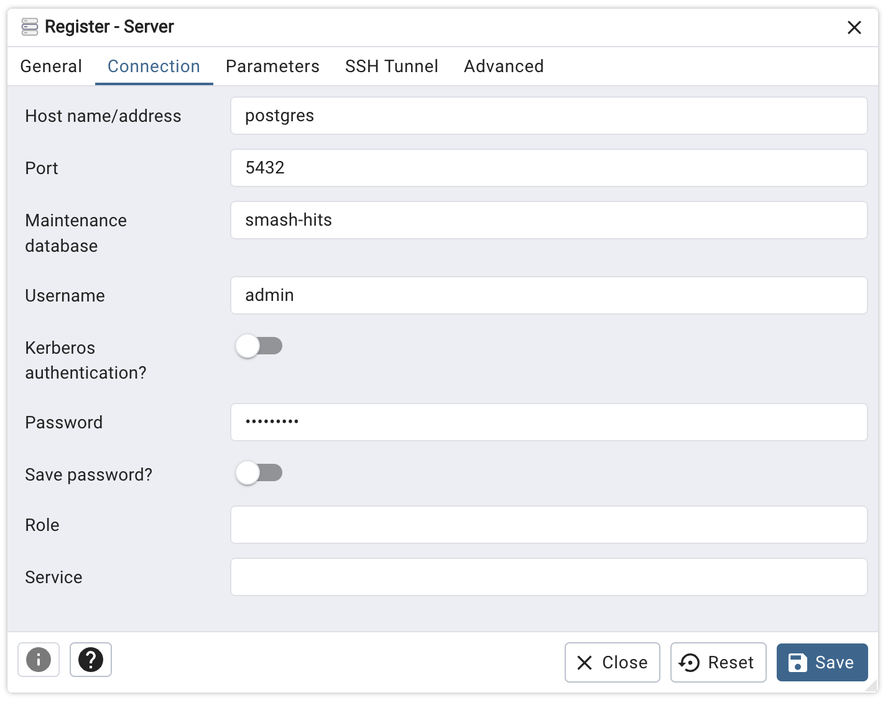
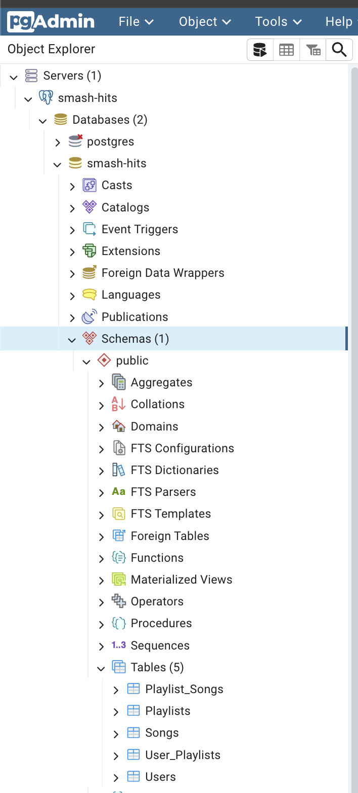

# SMASH HITS API

## Description
Smash-Hits is a Web API designed and implemented in NestJS, which allows its users to create, update and manage playlists and songs. The API offers different services, among them the connection to a third API, which feeds the system with metadata of real songs (Spotify-Web-Api).

### Components:
#### Users: 
- Users are those who can create and manage playlists, as well as associate songs to them. they are mainly composed by (email, name and password).

#### Auth: 
- Component where an existing user can authenticate and obtain an authentication token.

#### Registration: 
- Component where a new user can register.

#### Playlists:
- Group of songs that belong to a user, each user can have different playlists associated, which can be public or private.

#### Songs: 
- A song can belong to one or many playlists.


As a product of the many-to-many relationships between ***Users*** and ***Playlists*** and ***Songs*** and ***Playlist***, there are two more components

#### Playlist-song: 
- Manages the relationships between indexes of both Playlist and Song tables.
#### User-Playlist: 
- Manages the relationships between indexes of both User and Playlist tables.

#### ***Spotify***: 
- This component connects to the spotify API, and exposes a service that allows you to get the metadata of a specific song by its 
track name and artist. This component is used in the **Songs** component, and it is the one who helps to feed de DB with real data. Also It is the only component that does not require an authorization token of the smash-hits API.

### Database Diagram


## Installation

1.**Install dependencies**
```bash
$ npm install
```

2.**Configure env variables**:
In the file 'env.sample' are the local environment variables of the whole project, rename to '.env'.

3.**Database configuration**:
- The database was implemented in a Postgresql database engine, which is configured in a docker container, as well as the pgadmin service to interact with the database. 

Installing docker is a prerequisite to build the database.
For more information refer to: [Docker Installation](https://www.docker.com/products/docker-desktop/)

Once docker is installed, from the root of the project run:
```bash
docker-compose up -d 
```
The above command will raise the postgresql service, the pgadmin service and the necessary volume that will host the database.

## Running the app

```bash
# development
$ npm run start

# watch mode
$ npm run start:dev
```

## Database Population 
- In order to feed the database with some initial data, a seed file was created, which will fill the database with 
initial data, to run the seed run in another terminal:

```bash
  npm run seed
```

## PgAdmin configuration
If you want to view the structure and data in database, you can connect to PgAdmin as follows:

Go to the browser with the path: http://localhost:8080/ (Project must be up and running)

*Credentials*: 
- email: admin@postgres.com
- Password: admin

Once in the pgadmin Dashboard, you need to create a new database instance.

Go to Servers -> Right click (Register) -> Click (Server) ->
On general tab, set Name Example: smash-hits



- Then go to Connection tab and set the following data:
  - Host name: postgres
  - Port: 5432
  - Maintenance Database: smash-hits
  - Username: admin
  - password: root1234!

Finally save connection:



Once server is connected, tables will be visualized here: 




## Test
For executing unit tests run: 

```bash
$ npm run test
```
The tests cases implemented are related to playlists creation process

## Support

### API Documentation
- to visualize smash-hits Api documentation, go in the browser to: [swagger-documentation](http://localhost:3000/api-docs#/) **Note**: The app needs to be app and running

### Insomia API Collection
- There is an Api collection of each service with examples exported from [Insomia](https://insomnia.rest/download), it can be found on the smash-hits-collection.json, This file can be imported from other tools like Postman, but for its optimum configuration, it is recommended to be imported from Insomia.

  - [smash-hits-collection](./api-colection/smash-hits-collection.json)

#### Final Notes:
  Some of the important dependencies used:

  - Authentication:
    - PassportJs : As a autehtication strategy 
    - JWT: As standard to handle authentication through tokens
  
  - Parameters Validation:
    - Class-Validator: As validator of types and mandatory of the incoming endpoints parameters

  - Database:
    - PostgresQL: As data base
    - Sequelize: As ORM 

  - Spotify Api : As a third party to feed the system with real data

## Stay in touch
- Author - Juan Pablo Peña
- LinkedIn - [profile](https://www.linkedin.com/in/jpc16-86825a183/)
- Mail - juanpablovd97@hotmail.com

## License
MIT licensed
